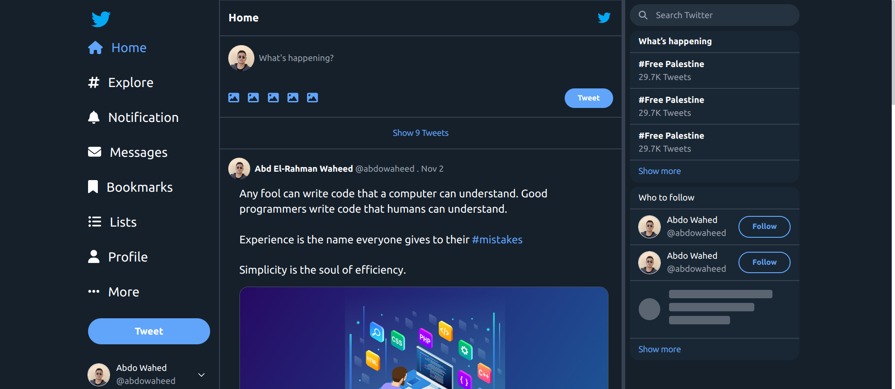
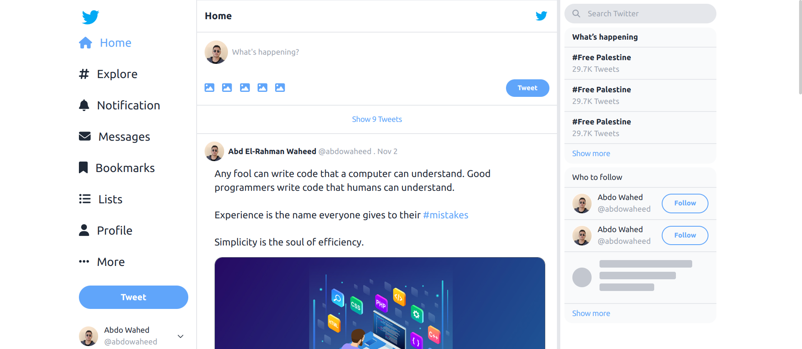
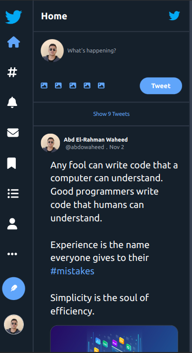
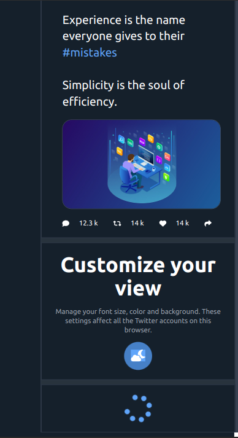
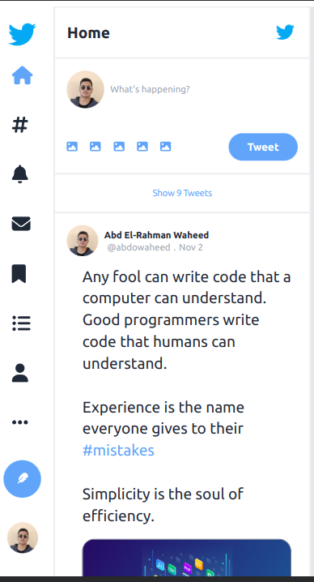
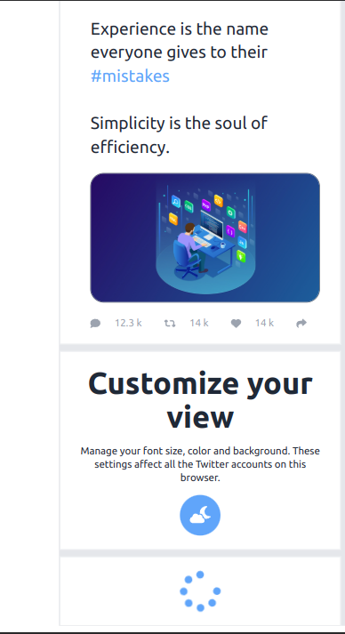

# Twitter Clone

<p align="center">
 
</p>


## Table of Contents

  

- [Table of Contents](#table-of-contents)

- [👋Introduction](#introduction)

- [🌟Features](#features)

- [🚀 Live Project](#-live-project)

- [📸 Screenshots](#-screenshots)

- [💡Technique Skills](#Technique-skills)

- [🛠️Technologies Used](#️technologies-used)

- [🏁Getting Started](#getting-started)

- [⬇️Installation](#️installation)

- [🔧Usage](#usage)

- [📄License](#license)

  

## 👋Introduction

  

The Twitter Clone project is a web application that mimics the functionality and design of the Twitter website. It includes features such as dark mode, loading posts, showing trends, and a responsive design.

  

## 🌟Features

  

- Loading Posts: Users show loader spinner spinning when wait posts is loading.

- Dark Mode: Users can switch between dark mode and lite mode .

- showing Trends: Users can show Top of Trends in right screen .

- View Nav Bar: Users can view Nav Bar in left Screen and in small screen traspher to icons.


## 🚀 Live project


[ Twitter Clone](https://twitter-clone-phi-five-62.vercel.app/)

  

## 📸 Screenshots

  















## 💡Technique Skills

- **TypeScript**
i used TypeScript for type safety
```
function Btn({children,style}:{ children:React.ReactNode,style?:string}) 
```
- **Reusable Button**
created reusable Button component like Btn.

```

function Btn({children,style}) {
    return (
      <button className={style?"btn w-fit": `btn bg-transparent hover:text-white duration-300 hover:bg-[rgb(96,165,250)] text-[rgb(96,165,250)] border-[2px] border-[rgb(96,165,250)]`}>
    {children}
  </button>
  )
}

export default Btn

```
- **Reusable Components**
created reusable components like Post.
```
import { FontAwesomeIcon } from "@fortawesome/react-fontawesome";
import {
  faComment,
  faRetweet,
  faHeart,
  faShare,
} from "@fortawesome/free-solid-svg-icons";
function Post() {
  return (
    <div className="section">
      <div className="flex items-center">
        
        <div className="space-x-1  flex items-center flex-wrap">
          <h1 className="md:w-full  font-bold">Abd El-Rahman Waheed</h1>
          <a className="text-dark-gray " href="#">
            @abdowaheed
          </a>
          <span className="text-dark-gray">&#46;</span>
          <p className=" text-dark-gray capitalize">nov 2</p>
        </div>
      </div>
      {/* start caption and photo and reacts */}
      <div className="pl-5 pr-2">
        <p className="text-xl leading-7 mt-3">
          Any fool can write code that a computer can understand. Good
          programmers write code that humans can understand.
          <br />
          <br />
          Experience is the name everyone gives to their{" "}
          <span className="text-[rgb(96,165,250)] cursor-pointer">
            #mistakes
          </span>{" "}
          <br />
          <br />
          Simplicity is the soul of efficiency.
        </p>
        
        <ul className=" flex justify-between items-center">
          <li className="react hover:text-blue-400 ">
            <FontAwesomeIcon icon={faComment} className="mr-4 " />
            12.3 k
          </li>
          <li className="react hover:text-green-400">
            <FontAwesomeIcon icon={faRetweet} className="mr-4 " />
            14 k
          </li>
          <li className="react hover:text-red-600">
            <FontAwesomeIcon icon={faHeart} className="mr-4 " />
            14 k
          </li>
          <li className="react  hover:text-blue-400">
            <FontAwesomeIcon icon={faShare} className="mr-4 " />
          </li>
        </ul>
      </div>
      {/* End caption and photo and reacts  */}
    </div>
  );
}

export default Post;

```

## 🛠️Technologies Used

  

The Twitter Clone project utilizes the following technologies:

  

-    &nbsp;  &nbsp;[Html](https://html.com/)

-    &nbsp;  &nbsp;[Css](https://www.w3.org/Style/CSS/Overview.en.html)

-    &nbsp;  &nbsp;[React](https://reactjs.org/)

-    &nbsp;  &nbsp;[TypeScript](https://www.typescriptlang.org/)

-    &nbsp;  &nbsp;[Fontawesome](https://fontawesome.com/)

-    &nbsp;  &nbsp;[Tailwindcss](https://tailwindcss.com/)


## 🏁Getting Started

  

To set up the Twitter Clone project locally, follow the instructions below.

  

## ⬇️Installation

  

To set up the project locally, follow these steps:

  

1. Clone the repository:

  

```bash

git clone https://github.com/Abdelrahman-wahed/twitter-clone.git

```

  

2. Navigate to the project directory:

```bash

cd twitter-clone

```

  

3. Install the required dependencies:

  

```bash

npm install

```

  

## 🔧Usage

  

1. Run the development server:

  

```bash

npm run dev

```

  

2. Open your browser and go to `http://localhost:5173/` to view the application.

  

## License

  

This project is licensed under the MIT License - see the [LICENSE](LICENSE.md) file for details.
